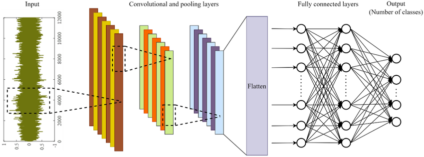
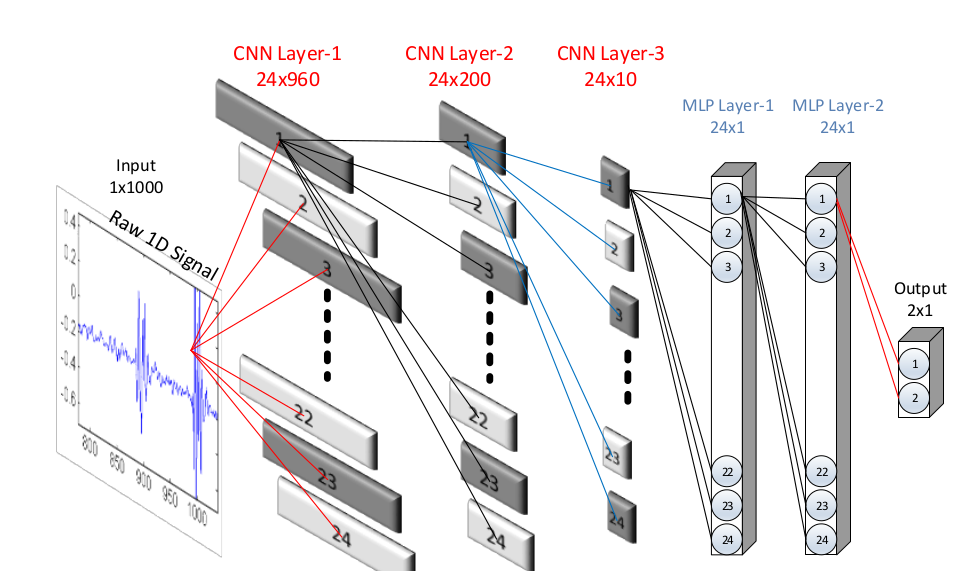
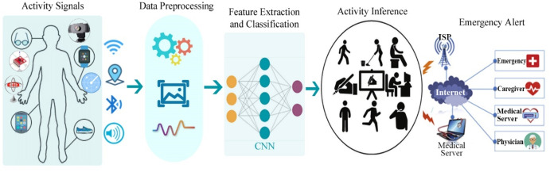

# Nghiên cứu về 1D Convolutional Neural Networks

> **Tài liệu nghiên cứu cho dự án PBL4 - Human Activity Recognition**

---

## Tổng quan

Mạng nơ-ron tích chập một chiều (1D CNNs) là một kiến trúc mạng nơ-ron chuyên biệt được thiết kế để xử lý hiệu quả các tín hiệu và chuỗi dữ liệu một chiều. Khác với 2D CNNs truyền thống được tối ưu cho xử lý hình ảnh, 1D CNNs mang lại hiệu suất vượt trội cho các ứng dụng như nhận dạng hoạt động con người, phân tích tín hiệu y tế, và xử lý dữ liệu cảm biến.

---

## 1. Bối cảnh và Động lực

### Giới thiệu về CNNs

Mạng nơ-ron tích chập (CNNs) đã trở thành tiêu chuẩn công nghiệp cho nhiều tác vụ **Thị giác máy tính** và **Học máy** trong thập kỷ qua. Đây là các mạng nơ-ron nhân tạo (ANNs) truyền thẳng với các lớp tích chập và pooling xen kẽ.

### Thách thức của 2D CNNs

Mặc dù 2D CNNs rất mạnh mẽ cho dữ liệu hình ảnh và video, chúng gặp nhiều hạn chế khi áp dụng cho tín hiệu 1D:

**Yêu cầu tài nguyên cao**
- Cần kiến trúc sâu với hàng triệu tham số
- Đòi hỏi cơ sở dữ liệu khổng lồ để huấn luyện
- Không khả thi khi dữ liệu khan hiếm

**Độ phức tạp tính toán**
- Cần phần cứng chuyên dụng (GPU clusters, cloud computing)
- Chi phí triển khai cao
- Khó tối ưu hóa cho thiết bị nhúng

**Không phù hợp thời gian thực**
- Độ trễ cao trên thiết bị di động
- Hạn chế về công suất và bộ nhớ
- Khó triển khai trên edge devices

### Giải pháp 1D CNNs

Để khắc phục những thách thức trên, **1D CNNs** đã được phát triển và nhanh chóng chứng minh hiệu suất vượt trội trong nhiều ứng dụng xử lý tín hiệu 1D.
---

## 2. Kiến trúc và Nguyên lý

### Đặc điểm cấu trúc

1D CNNs có thiết kế đơn giản và nhỏ gọn, thực hiện các phép tích chập 1D thông qua các phép nhân và cộng vô hướng.

### Thành phần chính

**Lớp CNN (Convolutional Layers)**
- Nơi diễn ra tích chập 1D và pooling
- Sử dụng các bộ lọc (kernel) 1D
- Tạo ra feature maps một chiều

**Lớp Fully-connected (MLP Layers)**
- Hoạt động giống như các lớp trong Mạng đa lớp Perceptron
- Thực hiện phân loại cuối cùng
- Kết nối đầy đủ giữa các nơ-ron

### Nguyên lý hoạt động

**Phép toán đơn giản**
- Sử dụng các phép toán mảng thay vì ma trận phức tạp
- Áp dụng cho cả quá trình truyền thẳng (FP) và truyền ngược (BP)
- Giảm thiểu độ phức tạp tính toán

**Bộ lọc và Feature Maps**
- Bộ lọc (kernel) là mảng 1D
- Feature maps cũng là mảng 1D
- Thay thế hoàn toàn ma trận 2D trong 2D CNNs

*Kiến trúc tổng quan của mô hình 1D CNN*

### Siêu tham số quan trọng

- **Số lượng lớp**: CNN layers và MLP layers
- **Kích thước kernel**: Trong mỗi lớp CNN
- **Pooling factor**: Hệ số lấy mẫu con
- **Activation functions**: Lựa chọn hàm kích hoạt
- **Pooling functions**: Lựa chọn hàm pooling

*Cấu hình mẫu: 3 lớp CNN + 2 lớp MLP*

### Quá trình huấn luyện

Mô hình được huấn luyện theo phương pháp có giám sát sử dụng thuật toán **Stochastic Gradient Descent** (SGD) và **Backpropagation** (BP).
---

## 3. Ưu điểm vượt trội

### Hiệu quả tính toán

**Độ phức tạp thấp**
- Giảm đáng kể độ phức tạp so với 2D CNNs
- Kiến trúc nông với ít lớp và nơ-ron hơn
- Dễ dàng huấn luyện và triển khai

**Khả năng học mạnh mẽ**
- Học được các tác vụ phức tạp với kiến trúc đơn giản
- Hiệu quả cao với tín hiệu 1D
- Tối ưu hóa trực tiếp từ dữ liệu thô

### Khả năng triển khai linh hoạt

**Tương thích phần cứng**
- Chạy hiệu quả trên CPU tiêu chuẩn
- Không cần GPU chuyên dụng
- Phù hợp với thiết bị có tài nguyên hạn chế

**Ứng dụng thời gian thực**
- Độ trễ thấp cho ứng dụng real-time
- Tiết kiệm năng lượng trên thiết bị di động
- Triển khai dễ dàng trên edge devices

### Hiệu quả với dữ liệu

**Tối ưu cho dữ liệu khan hiếm**
- Hiệu suất cao ngay cả với ít dữ liệu nhãn
- Phù hợp với dữ liệu có biến động cao
- Không cần dataset khổng lồ như 2D CNNs

**Tích hợp tối ưu**
- Kết hợp feature extraction và classification
- Tối ưu hóa end-to-end từ dữ liệu thô
- Tự động học các đặc trưng quan trọng
---

## 4. Phân tích độ phức tạp tính toán

1D CNNs đạt được độ phức tạp tính toán tối thiểu so với các phương pháp cạnh tranh, mang lại hiệu suất vượt trội trong nhiều ứng dụng thực tế.

### Forward Propagation

**Tính toán hiệu quả**
- Tổng số phép nhân và cộng được tối ưu hóa
- Dựa trên số lượng kết nối giữa các lớp
- Phụ thuộc vào kích thước kernel và feature maps

### Backward Propagation

**Quá trình tối ưu**
- Sử dụng hai phép tích chập chính
- Số lượng phép cộng không đáng kể so với phép nhân
- Thuật toán gradient descent hiệu quả

### Xử lý dữ liệu trực tiếp

**Không cần chuyển đổi**
- Xử lý trực tiếp tín hiệu 1D
- Tránh chi phí chuyển đổi 1D sang 2D
- Tiết kiệm tài nguyên và thời gian xử lý

---

## 5. Ứng dụng trong Human Activity Recognition

*Tổng quan*

### Tại sao lựa chọn 1D CNNs cho HAR?

#### Hiệu suất được chứng minh

1D CNNs đã thể hiện khả năng vượt trội trong việc xử lý tín hiệu từ cảm biến IMU, đạt được độ chính xác cao trong bài toán nhận dạng hoạt động con người (HAR).

#### Xử lý dữ liệu cảm biến tối ưu

**Tương thích hoàn hảo**
- Thiết kế đặc biệt cho dữ liệu 1D
- Loại bỏ việc chuyển đổi sang spectrogram hoặc hình ảnh
- Giữ nguyên đặc tính thời gian của tín hiệu

**Đặc tính dữ liệu IMU**
- Dữ liệu accelerometer và gyroscope là tín hiệu 1D
- Có tính tuần tự và phụ thuộc thời gian
- Phù hợp với cấu trúc 1D CNN

#### Triển khai thực tế

**Hiệu suất real-time**
- Độ trễ thấp trên thiết bị di động
- Xử lý nhanh với tài nguyên hạn chế
- Phù hợp với ứng dụng wearable devices

**Tối ưu hóa tài nguyên**
- Có thể huấn luyện trên CPU thông thường
- Không cần GPU cluster hoặc cloud computing
- Chi phí triển khai thấp

#### Kiến trúc tối ưu cho HAR

**Thiết kế đơn giản**
- Ít lớp ẩn và nơ-ron
- Dễ điều chỉnh và tối ưu hóa
- Khả năng tổng quát hóa tốt

**Học từ dữ liệu hạn chế**
- Hiệu quả với dataset nhỏ
- Không cần dữ liệu nhãn khổng lồ
- Phù hợp với dữ liệu cá nhân hóa

#### So sánh với phương pháp khác cho bài toán HAR với dữ liệu từ cảm biến IMU

| Phương pháp | Độ phức tạp | Độ chính xác | Thời gian real-time | Chi phí triển khai |
|-------------|-------------|--------------|---------------------|-------------------|
| **1D CNNs** | **Thấp** | **Cao** | **Tốt** | **Thấp** |
| 2D CNNs | Cao | Cao | Kém | Cao |
| SVM + Hand-crafted features | Trung bình | Trung bình | Tốt | Trung bình |
| LSTM/RNN | Trung bình | Cao | Trung bình | Trung bình |

---

## Tài liệu tham khảo

### Bài báo nghiên cứu chính

**"1D Convolutional Neural Networks and Applications: A Survey"**

>  **Tác giả: Serkan Kiranyaz, Onur Avci, Osama Abdeljaber, Turker Ince, Moncef Gabbouj, Daniel J.Inman
>  **Link**: [https://arxiv.org/pdf/1905.03554](https://arxiv.org/pdf/1905.03554)  
>  **Năm xuất bản**: 2019  
>  **Tóm tắt**: Nghiên cứu tổng quan về 1D CNNs và các ứng dụng trong xử lý tín hiệu một chiều, bao gồm phân tích hiệu suất, kiến trúc và so sánh với các phương pháp truyền thống.

**Tóm tắt nghiên cứu**

Bài báo này cung cấp một cái nhìn tổng quan về 1D CNNs và các ứng dụng trong xử lý tín hiệu một chiều. Nghiên cứu bao gồm phân tích hiệu suất, thiết kế kiến trúc, và so sánh với các phương pháp machine learning truyền thống.

### Thông tin bổ sung

**Lĩnh vực nghiên cứu**
- Machine Learning & Deep Learning
- Signal Processing & Time Series Analysis  
- Human Activity Recognition & Sensor Data Analysis

**Từ khóa chính**
- `1D CNN` `Convolutional Neural Networks` `HAR` `IMU Sensors` `Time Series Classification`

---

**Dự án PBL4 - Human Activity Recognition**  
*Nghiên cứu và phát triển mô hình nhận dạng hoạt động con người sử dụng cảm biến IMU*

